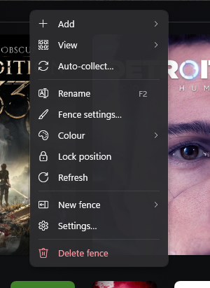
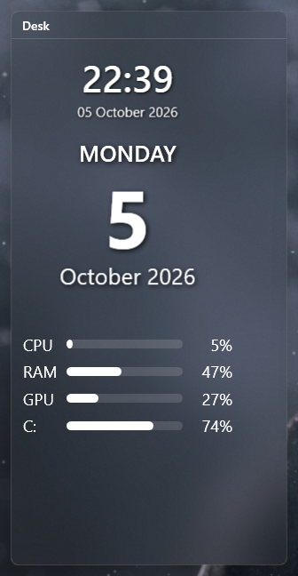
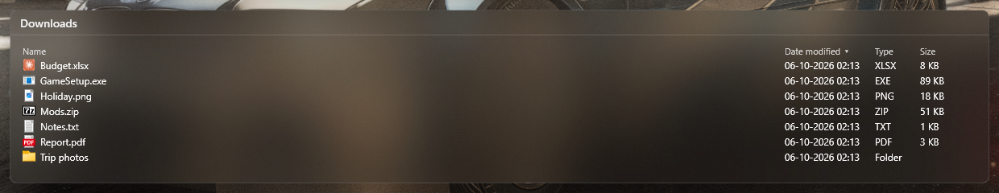
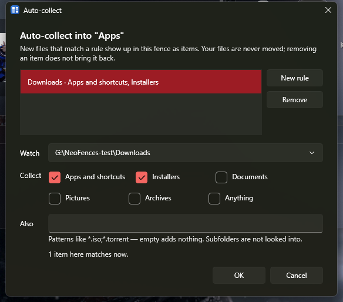
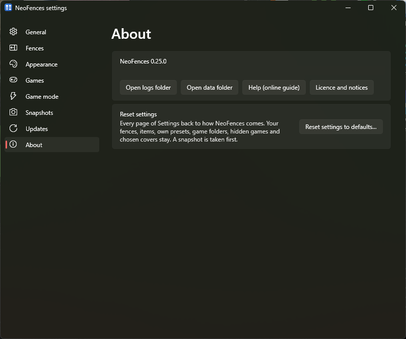

# The NeoFences guide

NeoFences puts translucent **fences** on your desktop. A fence holds **links** to your things — apps, games, files,
folders, websites — plus widgets and live folder panels. It never moves, renames or deletes a file of yours: removing
something from a fence only removes the link.

Almost everything starts from two places:

- **The fence menu** — right-click a fence's title or its empty space.
- **The tray menu** — click NeoFences' icon in the notification area (left or right click).

## Contents

1. [Fences](#1-fences)
2. [Items](#2-items)
3. [Games](#3-games)
4. [Sizes and layout](#4-sizes-and-layout)
5. [Widgets](#5-widgets)
6. [Folder panels](#6-folder-panels)
7. [Auto-collect](#7-auto-collect)
8. [The desktop: hiding icons, quick-hide, Peek](#8-the-desktop-hiding-icons-quick-hide-peek)
9. [Snapshots](#9-snapshots)
10. [Game mode](#10-game-mode)
11. [Updates](#11-updates)
12. [Settings](#12-settings)
13. [Your files are safe](#13-your-files-are-safe)
14. [Troubleshooting](#14-troubleshooting)
15. [Cheat-sheet](#15-cheat-sheet)

## 1. Fences

**Make a fence** in any of these ways:

- Tray → **New fence**, or fence menu → **New fence**.
- **Right-drag on empty desktop**: hold the right mouse button and draw a rectangle; let go and type the fence's name.
- Tray → **Add from desktop…** makes one fence per group of things on your desktop (see [Items](#2-items)).

**Name it:** fence menu → **Rename fence** (or double-click a tab's name).

**Move and resize:** drag the title to move; drag an edge or corner to resize. Fences snap to each other and to the
screen edges with a small gap.

**Roll up:** double-click the title. The fence shrinks to its title bar; it opens again when the mouse rests on it, or
when you click its title (choose in **Settings → Fences → Rolled-up fences open**). Double-click again to unroll.

**Lock position:** fence menu → **Lock position**. A locked fence cannot be moved or resized by accident.

**Tabs:** drag a fence by its title onto another fence's title: both become tabs of one box. Click a tab to show it,
**Ctrl+Tab** to switch, fence menu → **Detach tab** to take it out again.

**Colour:** fence menu → **Colour** — a swatch, **Custom…**, or **None**. How the colour shows (an edge, tinted glass or a
title strip), how solid the background is and the title font are in **Settings → Appearance**. **Colour fences from the
wallpaper** picks each fence's colour from the wallpaper behind it — Wallpaper Engine included.

**Delete:** fence menu → **Delete fence (your files are not touched)**. Only the fence and its links go.

## 2. Items

An item is a link with its own name, icon and note. The same file can be in several fences.

**Add items:**

- **Drag** files, folders or shortcuts from Explorer or the desktop onto a fence, an app from the Start menu, or a web
  address from your browser. The originals stay where they are.
- Fence menu → **Add item…**: type a path or a web address, or **Browse ▾** → **A file or program…**, **A folder…** or
  **An app…** (any app from Start, Store apps too). You can give it a name, arguments, **Run as administrator**, an icon
  (**Change icon ▾** → from a file, from a picture, or reset) and a note (shown when you hover it).
- Fence menu or tray → **Add from desktop…**: NeoFences reads your desktop and offers its things in groups — **Games**,
  **Apps**, **Folders and files**, **Web links**. Tick the groups you want; each becomes a fence of links (you can also
  tick **Hide desktop icons while NeoFences runs** there).

**Use items:** double-click (or **Enter**) to open. Right-click for NeoFences' menu: **Open**, **Run as administrator**,
**Open file location**, **Copy path**, **Size**, **Properties…**, **Remove from fence**, and for a folder **Show as folder
panel**. **Shift+right-click** shows Windows' own menu instead — it says so at the top, because only there can a rename
or delete reach the real file.

**Move and copy:** drag items within a fence or to another fence; hold **Ctrl** to copy them instead. Drag them out to
Explorer or another app and that app gets a copy of the file — the original stays.

**Change one:** **Properties…** (or **F2** with its name selected, or **Alt+Enter**).

**Missing items:** a link whose target is gone shows dimmed with a small **!** badge; one on a drive or network share
that is not connected just shows dimmed. Opening a missing one asks: **Locate…** (pick where it is now), **Remove from
fence**, or Cancel. After a Locate…, NeoFences offers to fix the other items that moved the same way, with a snapshot
first so it can be undone.

**Remove:** **Del** or **Remove from fence**. The file is never touched.

**Order:** drag to rearrange, or fence menu → **Sort by** (Name, Type, Date) to sort once. **Refresh** checks the links
again and reloads their icons.

## 3. Games

NeoFences finds your installed games — **Steam, Epic, GOG, Ubisoft Connect, EA app, Battle.net, Xbox / Microsoft
Store**, the **game folders** you add, and game shortcuts on your desktop — and shows them as cover tiles.

- Fence menu → **Add games…** lists every game NeoFences found; tick the ones you want in that fence.
- **Settings → Game Library**: **New games go to** (the fence where newly installed games appear), **Game folders (each
  sub-folder is a game)**, **Look for games in** (which launchers to read), **Hidden games** (**Show again**), and
  **Refresh library now**.
- A game's menu: **Open**, **Open install folder**, **Show as ▸ Cover tile / Icon**, **Copy path**, **Properties…**,
  **Remove from fence**. A game that is no longer installed says "Not installed".

## 4. Sizes and layout

- **Size:** right-click an item, widget or panel → **Size** and pick from a 4 × 4 grid (1 × 1 up to 4 × 4 cells), or
  **Default size**. With several things selected, it sets them all. The arrow keys and **Enter** work in the grid too.
- **Layout:** fence menu → **Layout** → **Flow (packed)** fills the fence in order; **Free (fixed positions)** keeps each
  thing where you drop it.
- **Icon size:** fence menu → **Icon size** (Small, Medium, Large, Extra large).
- **Labels:** fence menu → **Labels** → **Always**, or **On hover (icons only)** for a tight grid that shows a name only
  when you point at it.

## 5. Widgets

Fence menu → **Add widget** → **Clock**, **Date** or **System stats** (CPU, RAM, GPU and drive C: as bars). Size them
like anything else.

- Right-click the clock for **Show seconds** and **Show date**. It follows Windows' time format (12- or 24-hour).
- Double-click the clock to open Windows' Clock app, the stats to open Task Manager.
- Widgets do no work while nobody can see them — in a game, while paused or quick-hidden, or rolled up.

## 6. Folder panels

A folder panel shows a folder inside a fence, live and read-only.

- Fence menu → **Add folder panel…** adds one; **New folder panel…** (fence menu or tray) makes a new fence holding one
  that fills it; a folder item's menu → **Show as folder panel** turns it into one.
- Right-click the panel's name or empty space for its menu: **Look** (**Details**, **List**, **Icons**), **Sort by**,
  **Panel settings…** (the folder, what it shows, file types, only the newest N), **Open folder**, **Size**, **Fill
  fence** (when it is the fence's only element), **Show as icon**, **Remove from fence**.
- In Details, click a column header (**Name**, **Date modified**, **Type**, **Size**) to sort; click again to reverse.
- Double-click a subfolder to look inside; **Back**, **Up** and **Home** buttons (or **Backspace** and **Alt+Up**) bring
  you back. Next time the panel starts at its own folder again.
- Right-click an entry: **Open**, **Open file location**, **Copy path**, **Add to fence**. Drag entries out to copy them,
  or onto a fence to add links.
- Files dropped on a panel are refused — NeoFences never writes into the folder.

## 7. Auto-collect

A fence can collect new files by itself. Fence menu → **Auto-collect…** → **New rule**:

- **Watch**: Desktop, Downloads, or **Choose folder…**.
- **Collect**: **Apps and shortcuts**, **Installers**, **Documents**, **Pictures**, **Archives**, **Anything** — and
  **Also** your own patterns, like `*.iso`.
- The dialog shows how many files there match now. When you click OK it asks **"Add these N too?"** for those; after
  that, only new files are collected.

What happens next: a new matching file shows up in the fence within a couple of seconds, as a link — the file stays where
it is. If two fences' rules match, the fence higher in the list gets it. Remove a collected item and it stays removed.
Files that appear while NeoFences is closed are picked up at its next start. Nothing is collected during a game; it
catches up afterwards.

## 8. The desktop: hiding icons, quick-hide, Peek

- **Hide desktop icons:** **Settings → General → Hide desktop icons while NeoFences runs**. They come back whenever
  NeoFences exits — also after a crash or if it is ended in Task Manager.
- **Quick-hide:** double-click empty desktop to hide every fence (and the desktop icons) at once; double-click again, or
  tray → **Quick-hide**, to bring them back.
- **Peek:** **Ctrl+Alt+Space** lifts all fences above your open windows; press it again, **Esc**, click outside, or open
  something to send them back. Change the keys in **Settings → General → Peek hotkey**.
- **Pause:** tray → **Pause NeoFences** gives the desktop back to Windows (fences hidden, icons shown) until you resume.

## 9. Snapshots

A snapshot saves your fences, their places and their items.

- Tray → **Take snapshot**; tray → **Restore snapshot** → pick one.
- Every restore first saves "Before restore", so tray → **Restore snapshot** → **Undo the last restore or fix** takes you
  back.
- **Settings → Snapshots**: **Take snapshot**, **Restore**, **Rename**, **Delete** (to the Recycle Bin), **Open snapshots
  folder**.
- NeoFences also takes one by itself before big changes (for example before an update reshapes your fences).

## 10. Game mode

While a full-screen game is in front, NeoFences goes idle: fences stay at the bottom, the desktop mouse gestures and Peek
are off, widgets and folder panels stop updating, auto-collect waits, and update downloads pause. Turn it off in
**Settings → Game mode → Go idle while a full-screen game runs**.

## 11. Updates

NeoFences checks for updates and downloads them in the background. When one is ready the tray menu shows **Restart to
update to v…**; if you ignore it, the update installs the next time NeoFences exits. **Settings → Updates**: **Download
updates automatically** (on or off) and **Check now**.

## 12. Settings

Tray or fence menu → **Settings…**:

- **General** — **Start with Windows**, **Hide desktop icons while NeoFences runs**, **Peek hotkey**.
- **Fences** — **Labels for new fences** (and **Apply to all fences**), **Show shortcut arrows**, how **Rolled-up fences
  open**.
- **Appearance** — **Colour style** (**Accent edge**, **Tinted glass**, **Title strip**), **Background strength**,
  **Colour fences from the wallpaper**, **Title font**.
- **Game mode**, **Snapshots**, **Game Library**, **Updates** — see their sections above.
- **About and logs** — the version, **Open logs folder**, **Open data folder**, **Help (online guide)**.

## 13. Your files are safe

- NeoFences keeps **links only**. Removing an item, a panel or a fence never touches a file, folder, app or game.
- It never writes into a folder you show in a panel or watch with auto-collect.
- Hidden desktop icons **always come back**: when NeoFences exits, crashes, or is ended in Task Manager (a small helper
  watches for that), and when you uninstall it.
- Everything it keeps is in `%LOCALAPPDATA%\NeoFences`: settings (`config.json`), items (`items.json`), daily backups,
  snapshots and logs. If a file there is damaged, NeoFences starts from its backup.

## 14. Troubleshooting

- **Desktop icons stay hidden** (very unlikely): right-click the desktop → **View** → **Show desktop icons**.
- **"Windows protected your PC"** when installing: **More info → Run anyway** (NeoFences is not code-signed yet). With
  **Smart App Control** on, Windows blocks unsigned apps without that button; NeoFences cannot run there until it is
  signed.
- **A fence is off-screen** after changing monitors: NeoFences moves fences back onto a screen by itself when the displays
  change; if one still hides, **Settings → Snapshots → Restore** an earlier layout.
- **Something went wrong:** **Settings → About and logs → Open logs folder** and look at the newest file; report problems
  on the project's GitHub Issues page with what you did and that log.

## 15. Cheat-sheet

| Where | Do this | What happens |
|---|---|---|
| Empty desktop | Right-drag | Draw a new fence |
| Empty desktop | Double-click | Quick-hide (again: show) |
| Anywhere | **Ctrl+Alt+Space** (then **Esc**) | Peek: fences above windows (and back) |
| Fence title | Double-click | Roll up / unroll |
| Fence title | Drag onto another fence's title | Make tabs |
| Fence | **Ctrl+Tab** / **Ctrl+Shift+Tab** | Next / previous tab |
| Fence | Right-click | Fence menu |
| Item | Double-click or **Enter** | Open |
| Item | Right-click / **Shift+right-click** | NeoFences' menu / Windows' menu |
| Item | **Del** | Remove from fence (the file stays) |
| Item | **F2** / **Alt+Enter** | Properties |
| Item | Drag / **Ctrl**+drag | Move / copy (to another fence too) |
| Empty fence space | Drag | Select several |
| Folder panel | Double-click a subfolder; **Backspace**, **Alt+Up** | Look inside; back, up |
| Size grid | Arrow keys, **Enter** | Choose and set a size |
| Tray icon | Click | Tray menu |
