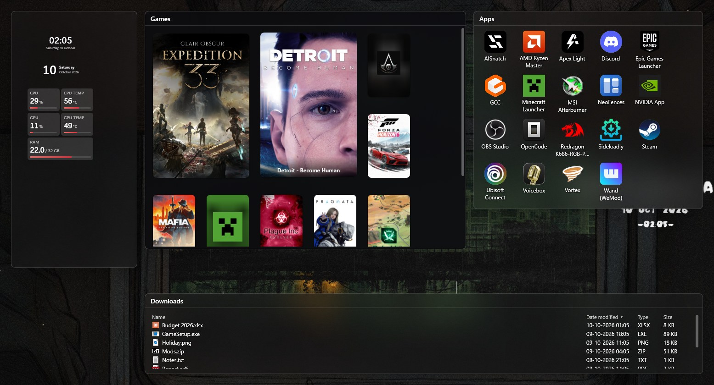
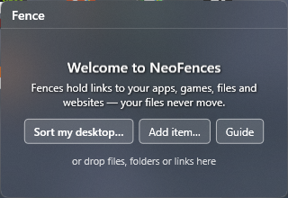
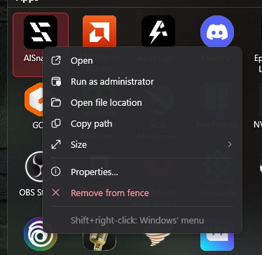
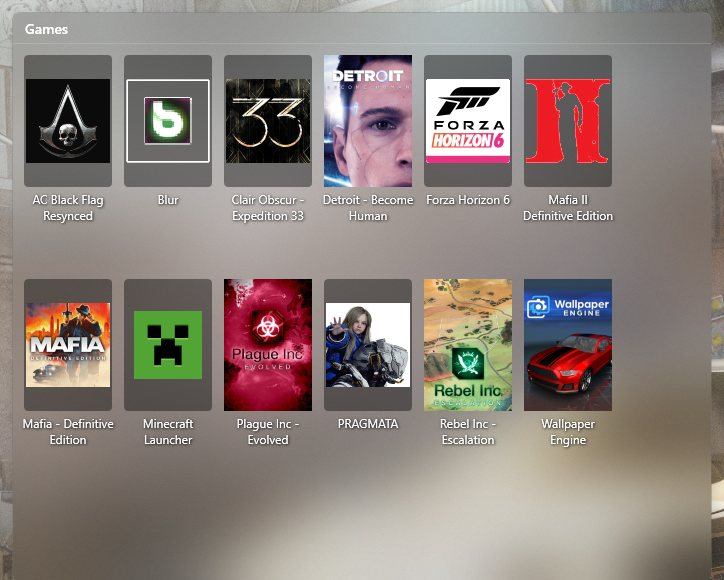
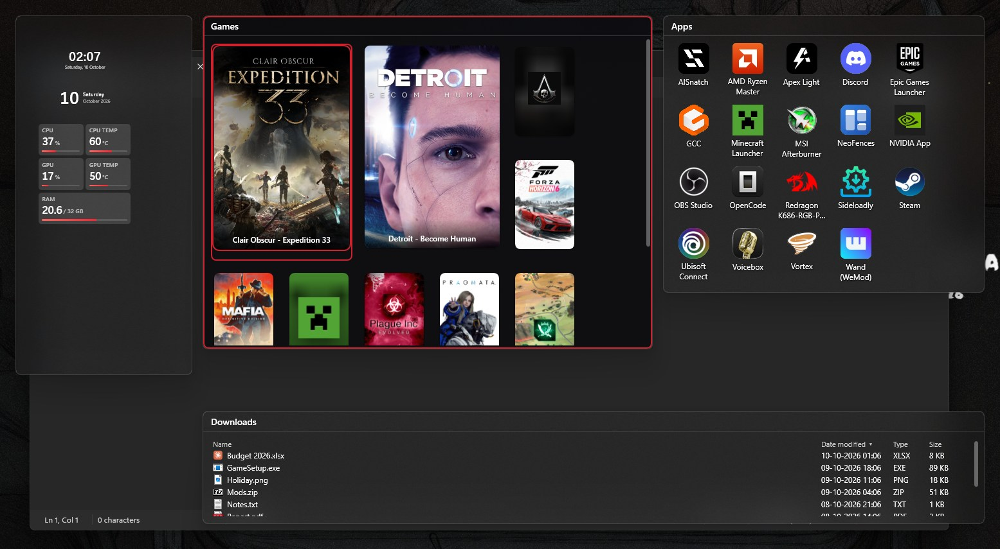

# The NeoFences guide

NeoFences puts translucent **fences** on your desktop. A fence holds **links** to your things — apps, games, files,
folders, websites — plus widgets and live folder panels. It never moves, renames or deletes a file of yours: removing
something from a fence only removes the link.

Almost everything starts from two places:

- **The fence menu** — right-click a fence's title or its empty space.
- **The tray menu** — click NeoFences' icon in the notification area (left or right click). Windows 11 may tuck a new app's icon behind the **^** arrow next to the clock; drag it onto the taskbar to keep it in view.

New here? Start with [Install](#install) and [First start](#first-start).

## Contents

1. [Fences](#1-fences)
2. [Items](#2-items)
3. [Games](#3-games)
4. [Sizes and layout](#4-sizes-and-layout)
5. [Widgets](#5-widgets)
6. [Folder panels](#6-folder-panels)
7. [Auto-collect](#7-auto-collect)
8. [The desktop: hiding icons, quick-hide, Peek](#8-the-desktop-hiding-icons-quick-hide-peek)
9. [Snapshots](#9-snapshots)
10. [Game mode](#10-game-mode)
11. [Updates](#11-updates)
12. [Settings](#12-settings)
13. [Your files are safe](#13-your-files-are-safe)
14. [Troubleshooting](#14-troubleshooting)
15. [Cheat-sheet](#15-cheat-sheet)

## Install

NeoFences runs on **Windows 11** (64-bit) and is free (see the [licence](../LICENSE.txt)).

1. Download **NeoFences.App-win-Setup.exe** from the
   [latest release](https://github.com/CipherSnowden/neo-fences/releases/latest).
2. Run it. Windows SmartScreen may say **"Windows protected your PC"**: NeoFences is not code-signed (a certificate costs
   money every year), and Windows warns about new unsigned apps until enough people have run them. Click **More info**,
   then **Run anyway**. NeoFences installs for your account only (no administrator rights), starts, and from then on
   keeps itself up to date.
3. If Windows says **Smart App Control** blocked NeoFences: that Windows 11 feature lets only signed or well-known apps
   run, and it has no "Run anyway". Turning it off is your decision — read
   [Microsoft's Smart App Control FAQ](https://support.microsoft.com/en-us/windows/security/threat-malware-protection/smart-app-control-frequently-asked-questions)
   first.

Want to be sure the file is the real one? See "Check your download" in the
[README](https://github.com/CipherSnowden/neo-fences#check-your-download). To uninstall: Windows Settings → Apps →
Installed apps → NeoFences → Uninstall (your desktop icons come back; your files are never touched).

## First start

After installing, NeoFences starts with one fence: the **welcome**. It says what NeoFences is and offers three buttons:

- **Sort my desktop…** opens **Add from desktop…**: pick the groups you want (Games, Apps, Folders and files, Web links);
  each becomes a fence of links to what is on your desktop. Tick **Hide desktop icons while NeoFences runs** there if you
  want only the fences on your desktop (the icons come back whenever NeoFences exits). Once the new fences are made, the
  empty welcome fence goes away by itself.
- **Add item…** adds one file, folder, app or website to this fence.
- **Guide** opens this guide.

You can also drop files, folders or links onto the welcome fence: it then becomes an ordinary fence named "Fence"
(rename it from its menu). A Windows notice says where NeoFences' icon is: in the notification area next to the clock,
maybe behind the **^** arrow on Windows 11.

## 1. Fences

**Make a fence** in any of these ways:

- Tray → **New fence**, or fence menu → **New fence** → **Empty**.
- **Right-drag on empty desktop**: hold the right mouse button and draw a rectangle; let go and type the fence's name.
- Tray → **Add from desktop…** makes one fence per group of things on your desktop (see [Items](#2-items)).

**Name it:** fence menu → **Rename** (**Rename tab** in a fence with tabs; or double-click a tab's name).

**Move and resize:** drag the title to move; drag an edge or corner to resize. Fences snap to each other and to the
screen edges with a small gap.

**Roll up:** double-click the title. The fence shrinks to its title bar; it opens again when the mouse rests on it, or
when you click its title (choose in **Settings → Fences → Rolled-up fences open**). Double-click again to unroll.

**Lock position:** fence menu → **Lock position**. A locked fence cannot be moved or resized by accident.

**Tabs:** drag a fence by its title onto another fence's title: both become tabs of one box. Click a tab to show it,
**Ctrl+Tab** to switch, fence menu → **Detach tab** to take it out again.

**Colour:** fence menu → **Colour** — click a round swatch (or **None**), **Use my accent colour**, or **Custom colour…**
for any colour (a colour field, a hue bar and a hex box). How the colour shows (an edge, tinted glass or a
title strip), how solid the background is and the title font are in **Settings → Appearance**. **Colour fences from the
wallpaper** picks each fence's colour from the wallpaper behind it — Wallpaper Engine included.

**Fence settings:** fence menu → **Fence settings…** (**Tab settings…** on a tab) gives one fence a look of its own. Each
change shows on the fence at once; close the window when you are done.

- **Preset**: one click for a whole look — **Glass** (tinted glass, light background, names below), **Minimal** (title bar
  on hover, almost no background, names on hover), **Title strip** (a coloured title bar over a dark background),
  **Solid** (a dense background with the accent edge, roomy spacing), **Compact** (small icons, compact spacing, names on
  hover), and your own. **Save this look as a preset…** keeps the fence's look under a name; the small **✕** next to your
  own preset deletes it. A preset is copied onto the fence: changing the fence later does not change the preset or other
  fences. The fence keeps its colour.
- **Look**: **Colour style**, **Background** (one strength for light and dark mode), **Title** (font, size, weight,
  alignment) and **Show the title bar** — off, the title bar shows only while the pointer is over the fence, so you can
  still move, roll up and rename it.
- **Items**: **Icon size**, **Labels**, **Layout** and **Spacing** (**Compact**, **Normal**, **Roomy**).
- Every look setting starts at **Like all fences (…)**: what Settings → Appearance says. A setting of the fence's own is
  marked **This fence's own**; **Like all fences again** (or the **Like all fences** preset) drops them all.

**Delete:** fence menu → **Delete fence**. Only the fence and its links go; your files are not touched. NeoFences
takes a snapshot first; **Ctrl+Z** in a fence, or tray → **Undo delete**, brings it back for 2 minutes. (Keys reach a fence after
a click on the desktop or the fence; from another app use the tray.)

## 2. Items

An item is a link with its own name, icon and note. The same file can be in several fences.

**Add items:**

- **Drag** files, folders or shortcuts from Explorer or the desktop onto a fence, an app from the Start menu, or a web
  address from your browser. The originals stay where they are.
- Fence menu → **Add** → **Item…**: type a path or a web address, or **Browse ▾** → **A file or program…**, **A folder…** or
  **An app…** (any app from Start, Store apps too). You can give it a name, arguments, **Run as administrator**, an icon
  (**Change icon ▾** → from a file, from a picture, or reset) and a note (shown when you hover it).
- Fence menu → **Add** → **From desktop…** (or tray → **Add from desktop…**): NeoFences reads your desktop and offers its things in groups — **Games**,
  **Apps**, **Folders and files**, **Web links**. Tick the groups you want; each becomes a fence of links (you can also
  switch on **Hide desktop icons while NeoFences runs** there).

**Use items:** double-click (or **Enter**) to open. Right-click for NeoFences' menu: **Open**, **Run as administrator**,
**Open file location**, **Copy path**, **Size**, **Properties…**, **Remove from fence**, and for a folder **Show as folder
panel**. **Shift+right-click** shows Windows' own menu instead — it says so at the top, because only there can a rename
or delete reach the real file.

**Move and copy:** drag items within a fence or to another fence; hold **Ctrl** to copy them instead. Drag them out to
Explorer or another app and that app gets a copy of the file — the original stays.

**Change one:** **Properties…** (or **F2** with its name selected, or **Alt+Enter**).

**Website icons:** a web link shows the site's own icon when **Find covers and website icons online** is on (Settings →
Games); otherwise a coloured letter (a red **Y** for YouTube) instead of your browser's icon.

**Missing items:** a link whose target is gone shows dimmed with a small **!** badge; one on a drive or network share
that is not connected just shows dimmed. Opening a missing one asks: **Locate…** (pick where it is now), **Remove from
fence**, or Cancel. After a Locate…, NeoFences offers to fix the other items that moved the same way, with a snapshot
first so it can be undone.

**Remove:** **Del** or **Remove from fence**. The file is never touched. An **Undo** bar shows for a few
seconds; **Ctrl+Z** in the fence works too.

**Order:** drag to rearrange, or fence menu → **View** → **Sort by** (**Name**, **Type**, **Date (newest first)**) to sort once. **Refresh** checks the links
again and reloads their icons.

## 3. Games

NeoFences finds your installed games — **Steam, Epic, GOG, Ubisoft Connect, EA app, Battle.net, Xbox / Microsoft
Store**, the **game folders** you add, and game shortcuts on your desktop — and shows them as cover tiles.

- Fence menu → **Add** → **Games…** lists every game NeoFences found; tick the ones you want in that fence.
- **Settings → Games**: **New games go to** (the fence where newly installed games appear), **Game folders (each
  sub-folder is a game)**, **Look for games in** (which launchers to read), **Hidden games** (games hidden in older versions; **Show again**), and
  **Refresh library now**, and **Find covers and website icons online**.
- A game's menu: **Open**, **Show as ▸ Cover tile / Icon**, **Choose cover…**, **Size ▸ Normal / Large (twice as big)**, **Open install folder**, **Copy path**,
  **Properties…**, **Remove from fence**. A game that is no longer installed says "Not installed".
- **Covers:** Steam games bring their cover from your disk. For the others NeoFences can **find covers online** on the
  Steam store: it asks ("Find covers online?"; **Not now** asks again the next time NeoFences starts), and the switch is **Settings → Games → Find covers and website
  icons online**. Only the names of games without a cover are sent, and only an exact name counts. A game without a cover
  shows its icon on a tile in its own colours.
- **Choose cover…** (a game's menu): pick one of the Steam store's covers for its name, **From a file…** (NeoFences keeps a
  copy; your picture is not moved), or **Reset to automatic**.

## 4. Sizes and layout

- **Size:** right-click an item, widget or panel → **Size** and pick from a 4 × 4 grid (1 × 1 up to 4 × 4 cells), or
  **Default size**. With several things selected, it sets them all. A game cover has two sizes: **Normal** and **Large (twice as big)**. The arrow keys and **Enter** work in the grid too.
- **Layout:** fence menu → **View** → **Layout** → **Flow (packed)** fills the fence in order; **Free (fixed positions)** keeps each
  thing where you drop it.
- **Icon size:** fence menu → **View** → **Icon size** (Small, Medium, Large, Extra large).
- **Labels:** fence menu → **View** → **Labels** → **Always**, or **On hover (icons only)** for a tight grid that shows a name only
  when you point at it. A game cover then shows its name over itself.
- **Spacing:** fence menu → **Fence settings…** → **Spacing**: **Compact**, **Normal** or **Roomy** room between the
  things in a fence (they keep their size).

## 5. Widgets

Fence menu → **Add** → **Widget** → **Clock**, **Date** or **System stats**. Size them like anything else.

- Right-click the clock for **Show seconds** and **Show date**. It follows Windows' time format (12- or 24-hour).
- **System stats** shows five tiles: **CPU** and **GPU** use, **CPU TEMP** and **GPU TEMP**, and **RAM** in use (e.g.
  "13.0 / 32 GB"). The bars take your Windows accent colour. Right-click it for **Temperature in °F**.
- Temperatures: Windows lets apps read the CPU temperature only through a hardware monitor. If **MSI Afterburner** or
  **HWiNFO64** (with its "Shared Memory Support" on) is running, NeoFences reads their values — read-only, nothing to
  set up. Without one, CPU TEMP shows "—" and the GPU temperature comes from Windows. The graphics card shown is the one
  using the most video memory (not a built-in one).
- Double-click the clock to open Windows' Clock app, the stats to open Task Manager.
- Widgets do no work while nobody can see them — in a game, while paused or quick-hidden, or rolled up.

## 6. Folder panels

A folder panel shows a folder inside a fence, live and read-only.

- Fence menu → **Add** → **Folder panel…** adds one; fence menu → **New fence** → **Folder panel…** (or tray → **New folder
  panel…**) makes a new fence holding one
  that fills it; a folder item's menu → **Show as folder panel** turns it into one.
- Right-click the panel's name or empty space for its menu: **Open folder**, **Look** (**Details**, **List**,
  **Icons**), **Sort by**, **Panel settings…** (the folder, what it shows, file types, only the newest N), **Size**, **Fill
  fence** (when it is the fence's only element), **Show as icon**, **Remove from fence**.
- In Details, click a column header (**Name**, **Date modified**, **Type**, **Size**) to sort; click again to reverse.
- Double-click a subfolder to look inside; the **Back**, **Up** and **Back to the panel's folder** buttons (or **Backspace** and **Alt+Up**) bring
  you back. Next time the panel starts at its own folder again.
- Right-click an entry: **Open**, **Open file location**, **Copy path**, **Add to fence**. Drag entries out to copy them,
  or onto a fence to add links.
- Files dropped on a panel are refused — NeoFences never writes into the folder.

## 7. Auto-collect

A fence can collect new files by itself. Fence menu → **Auto-collect…** → **New rule**:

- **Watch**: Desktop, Downloads, or **Choose folder…**.
- **Collect**: **Apps and shortcuts**, **Installers**, **Documents**, **Pictures**, **Archives**, **Anything** — and
  **Also** your own patterns, like `*.iso`.
- The dialog shows how many files there match now. When you click OK it asks **"Add these N too?"** for those; after
  that, only new files are collected.

What happens next: a new matching file shows up in the fence within a couple of seconds, as a link — the file stays where
it is. If two fences' rules match, only one of them gets it (the fence made first). Remove a collected item and it stays removed.
Files that appear while NeoFences is closed are picked up at its next start. Nothing is collected during a game; it
catches up afterwards.

## 8. The desktop: hiding icons, quick-hide, Peek

- **Hide desktop icons:** **Settings → General → Hide desktop icons while NeoFences runs**. They come back whenever
  NeoFences exits — also after a crash or if it is ended in Task Manager.
- **Quick-hide:** double-click empty desktop to hide every fence (and the desktop icons) at once; double-click again, or
  tray → **Quick-hide**, to bring them back.
- **Gesture switches:** **Settings → General → Double-click the desktop to quick-hide** and **Right-drag on the desktop
  to draw a fence** turn each gesture off. With both off, NeoFences does not watch mouse clicks at all.
- **Peek:** **Ctrl+Alt+Space** lifts all fences above your open windows and puts the keyboard in a fence — the one under
  the mouse, else the one you used last, else the first (left to right, top to bottom). An accent outline shows which
  fence has the keyboard. **Arrow keys**, **Home** and **End** move between items, **Enter** opens, **Tab** /
  **Shift+Tab** go to the next / previous fence. Press the hotkey again or **Esc** to send the fences back — the app you
  were in gets the keyboard back; a click outside or opening something also ends Peek. Change the keys in
  **Settings → General → Peek hotkey**.

  

- **Pause:** tray → **Pause NeoFences** gives the desktop back to Windows (fences hidden, icons shown) until you resume.

## 9. Snapshots

A snapshot saves your fences, their places and their items.

- Tray → **Take snapshot**; tray → **Restore snapshot** → pick one.
- Every restore first saves "Before restore", so tray → **Restore snapshot** → **Undo the last restore or fix** takes you
  back.
- **Settings → Snapshots**: **Take snapshot**, **Restore**, **Rename**, **Delete** (to the Recycle Bin), **Open snapshots
  folder**.
- NeoFences also takes one by itself before big changes (for example before an update reshapes your fences).

**Your whole setup in one file** (for another PC, or a fresh Windows):

- **Settings → Snapshots → Export setup…** saves one `.neofences` file: your fences, their items, places and looks, your
  settings, your own presets, and the pictures you chose as item icons and covers. Not the logs, not the game list (it is
  found again on any PC), and never your files themselves.
- **Settings → Snapshots → Import setup…** checks the file (a NeoFences export, readable, not from a newer NeoFences),
  asks, saves your current setup as the snapshot "Before import", then puts the file's setup in place. To undo, restore
  "Before import". Items whose files or apps are not on this PC show as missing, as usual.

## 10. Game mode

While a full-screen game is in front, NeoFences goes idle: fences stay at the bottom, the desktop mouse gestures and Peek
are off, widgets and folder panels stop updating, auto-collect waits, and update downloads pause. Turn it off in
**Settings → Game mode → Go idle while a full-screen game runs**.

## 11. Updates

NeoFences checks for updates and downloads them in the background. When one is ready the tray menu shows **Restart to
update to v…**; if you ignore it, the update installs the next time NeoFences exits. **Settings → Updates**: **Download
updates automatically** (on or off) and **Check now**.

## 12. Settings

Tray or fence menu → **Settings…**. A list of sections on the left opens one page at a time; on/off settings are switches
(**On** / **Off**):

- **General** — **Start with Windows**, **Hide desktop icons while NeoFences runs**, **Peek hotkey**.
- **Fences** — **Labels for new fences** (and **Apply to all fences**), **Show shortcut arrows**, how **Rolled-up fences
  open**.
- **Appearance** — **Colour style** (**Accent edge**, **Tinted glass**, **Title strip**), **Background strength**,
  **Colour fences from the wallpaper**, **Title font**. A fence can have its own of each (fence menu → **Fence settings…**).
- **Games**, **Game mode**, **Snapshots**, **Updates** — see their sections above. **Snapshots** also has **Export setup…** and
  **Import setup…**.
- **About** — the version, **Open logs folder**, **Open data folder**, **Help (online guide)**, **Licence and notices**
  (the licence; the third-party notices and the privacy note are next to it), and **Reset settings
  to defaults…**: every page of Settings back to how NeoFences comes (asked first, a snapshot "Before reset" first). Your
  fences, items, own presets, game folders, hidden games and chosen covers stay.

## 13. Your files are safe

- NeoFences keeps **links only**. Removing an item, a panel or a fence never touches a file, folder, app or game.
- It never writes into a folder you show in a panel or watch with auto-collect.
- Hidden desktop icons **always come back**: when NeoFences exits, crashes, or is ended in Task Manager (a small helper
  watches for that), and when you uninstall it.
- With **Find covers and website icons online** on, NeoFences sends the names of games without a cover to the Steam store
  and asks your web links' sites for their icons; nothing else leaves your PC. Updates come from GitHub. Pictures it finds
  are kept in `%LOCALAPPDATA%\NeoFences\covers`.
- Everything it keeps is in `%LOCALAPPDATA%\NeoFences`: settings (`config.json`), items (`items.json`), daily backups,
  snapshots and logs. If a file there is damaged, NeoFences starts from its backup.

## 14. Troubleshooting

- **Desktop icons stay hidden** (very unlikely): right-click the desktop → **View** → **Show desktop icons**.
- **The browser warns about the download** ("isn't commonly downloaded"): in Edge, **…** → **Keep** → **Show more** → **Keep anyway**; in Chrome, **Keep**. NeoFences is new and unsigned, so few people have downloaded it yet.
- **"Windows protected your PC"** when installing: **More info → Run anyway** (NeoFences is not code-signed yet). With
  **Smart App Control** on, Windows blocks unsigned apps without that button; NeoFences cannot run while Smart
  App Control is on.
- **A fence is off-screen** after changing monitors: NeoFences moves fences back onto a screen by itself when the displays
  change; if one still hides, **Settings → Snapshots → Restore** an earlier layout.
- **An icon looks out of date** (an app updated its icon): fence menu → **Refresh** asks Windows again. NeoFences keeps
  icons in `%LOCALAPPDATA%\NeoFences\cache` to start faster; deleting that folder is safe (it fills again).
- **"NeoFences started in safe mode"**: it stopped unexpectedly several times in a row, so it started with fences
  only (no widgets updating, folder panels as plain folders, no gestures, no auto-collect). Tray → **Leave safe mode**
  starts it normally again. If it keeps stopping, report it with the log.
- **"NeoFences stopped after repeated crashes"**: safe mode stopped too. **Open logs** for the report; **Start from a
  backup** saves your current setup as a snapshot and starts safe mode with the newest daily backup; **Close** leaves it
  off until you start it again.
- **"Changes are not saved"**: NeoFences could not read or write its files (another program locking them, or a file from
  a newer version). Your fences work, but changes are lost at exit; restart NeoFences, and see the log.
- **Something went wrong:** **Settings → About → Open logs folder** and look at the newest file; report problems
  with the **Bug** form on the project's [GitHub Issues page](https://github.com/CipherSnowden/neo-fences/issues/new/choose):
  what you did, what happened, and that log if you like.
  Logs never contain your Windows user name (the profile folder is written as `%USERPROFILE%`), but they name the
  folders and files your fences point at — look through a log before you attach it. Security problems: privately, see
  [SECURITY.md](../SECURITY.md).
- **CPU TEMP shows "—"**: start MSI Afterburner (with "CPU temperature" ticked in its Settings → Monitoring) or HWiNFO64 (in HWiNFO, turn on "Shared Memory Support" in its
  settings; the free version turns it off again after 12 hours).

## 15. Cheat-sheet

| Where | Do this | What happens |
|---|---|---|
| Empty desktop | Right-drag | Draw a new fence |
| Empty desktop | Double-click | Quick-hide (again: show) |
| Anywhere | **Ctrl+Alt+Space** (then **Esc**) | Peek: fences above windows, the keyboard in a fence (and back to your app) |
| Peek | **Tab** / **Shift+Tab** | Next / previous fence |
| Fence title | Double-click | Roll up / unroll |
| Fence title | Drag onto another fence's title | Make tabs |
| Fence | **Ctrl+Tab** / **Ctrl+Shift+Tab** | Next / previous tab |
| Fence | Right-click | Fence menu |
| Item | Double-click or **Enter** | Open |
| Item | Right-click / **Shift+right-click** | NeoFences' menu / Windows' menu |
| Item | **Del** | Remove from fence (the file stays) |
| Fence | **Ctrl+Z** | Undo the last removal or fence deletion |
| Item | **F2** / **Alt+Enter** | Properties |
| Item | Drag / **Ctrl**+drag | Move / copy (to another fence too) |
| Empty fence space | Drag | Select several |
| Folder panel | Double-click a subfolder; **Backspace**, **Alt+Up** | Look inside; back, up |
| Size grid | Arrow keys, **Enter** | Choose and set a size |
| Tray icon | Click | Tray menu |
